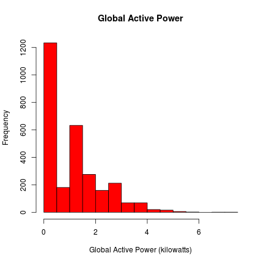
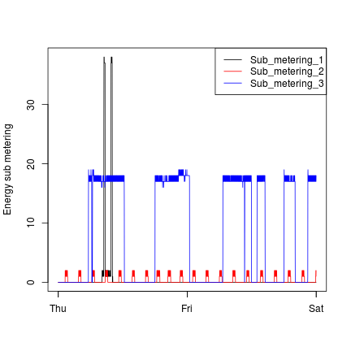
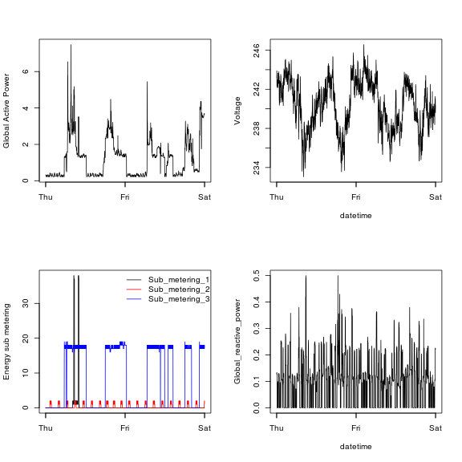

Exploratory Graphs Project 1
========================================================

Loading the data

When loading the dataset into R, please consider the following:

    The dataset has 2,075,259 rows and 9 columns. First calculate a rough estimate of how much memory the dataset will require in memory before reading into R. Make sure your computer has enough memory (most modern computers should be fine).

    We will only be using data from the dates 2007-02-01 and 2007-02-02. One alternative is to read the data from just those dates rather than reading in the entire dataset and subsetting to those dates.

    You may find it useful to convert the Date and Time variables to Date/Time classes in R using the strptime() and as.Date() functions.

    Note that in this dataset missing values are coded as ?.

Making Plots

Our overall goal here is simply to examine how household energy usage varies over a 2-day period in February, 2007. Your task is to reconstruct the following plots below, all of which were constructed using the base plotting system.

First you will need to fork and clone the following GitHub repository: https://github.com/rdpeng/ExData_Plotting1

For each plot you should

    Construct the plot and save it to a PNG file with a width of 480 pixels and a height of 480 pixels.

    Name each of the plot files as plot1.png, plot2.png, etc.

    Create a separate R code file (plot1.R, plot2.R, etc.) that constructs the corresponding plot, i.e. code in plot1.R constructs the plot1.png plot. Your code file should include code for reading the data so that the plot can be fully reproduced. You should also include the code that creates the PNG file.

    Add the PNG file and R code file to your git repository

When you are finished with the assignment, push your git repository to GitHub so that the GitHub version of your repository is up to date. There should be four PNG files and four R code files.

The four plots that you will need to construct are shown below. 


Solution
========================================================

I started by watching two videos on how to 
fork and clone GitHub repositories:

- [Fork and clone a repopsitory on GitHub](https://www.youtube.com/watch?v=CQn4DxFMUv8)
- [SkilCast™ - GitHub Add, Rename, and Remove Repositories](https://www.youtube.com/watch?v=yM0sbCa0X6Q)

Then I forked Dr Roger Peng's repo to my account. Then cloned it in my local
directory in **~/datasciencecoursera$** where a new folder called **ExData_Plotting1**.

Note: a reminder of how to customize the R markdown chunks in [RPubs](http://rpubs.com/gallery/options).


```r
fileURL <- "https://d396qusza40orc.cloudfront.net/exdata%2Fdata%2Fhousehold_power_consumption.zip"
download.file( fileURL, destfile = "./data/hhpower.txt", method = "curl")
t<-read.table("./data/household_power_consumption.txt", 
              as.is=c(1,2), 
              colClasses=c("character", 'character', 'numeric','numeric','numeric',
                           'numeric','numeric','numeric','numeric'), 
              header=TRUE,
              sep=";",
              na.strings="?") # avoid the NA's in the original text file as per instructions
str(t)
```

```
## 'data.frame':	2075259 obs. of  9 variables:
##  $ Date                 : chr  "16/12/2006" "16/12/2006" "16/12/2006" "16/12/2006" ...
##  $ Time                 : chr  "17:24:00" "17:25:00" "17:26:00" "17:27:00" ...
##  $ Global_active_power  : num  4.22 5.36 5.37 5.39 3.67 ...
##  $ Global_reactive_power: num  0.418 0.436 0.498 0.502 0.528 0.522 0.52 0.52 0.51 0.51 ...
##  $ Voltage              : num  235 234 233 234 236 ...
##  $ Global_intensity     : num  18.4 23 23 23 15.8 15 15.8 15.8 15.8 15.8 ...
##  $ Sub_metering_1       : num  0 0 0 0 0 0 0 0 0 0 ...
##  $ Sub_metering_2       : num  1 1 2 1 1 2 1 1 1 2 ...
##  $ Sub_metering_3       : num  17 16 17 17 17 17 17 17 17 16 ...
```

Now turn the date and time character columns into real date classes. Testing with the 
conversions from character to Date class objects I found that
I have to merge the character vectors representing date and time into a single date
string that then gets converted into a Date class object.


```r
datetime <- mapply(FUN=function(x,y) paste(x,y,sep=" "),t$Date,t$Time,SIMPLIFY = TRUE,USE.NAMES=FALSE)
t$datetime <- as.POSIXct(datetime,format="%d/%m/%Y %H:%M:%S")
tail(t,1)[[10]] - head(t,1)[[10]]
```

```
## Time difference of 1441 days
```
This makes sense because the start date is Dec-16/2006 while
the end date is Nov-26/2010, which amounts to
3 years, 11 months, and 10 days, so roughly 3x365 + 11x30 + 10 = 1435 days.
The difference is explainable because most months have 31 days and there might be a leap year in there.


Let's filter the data from the dates 2007-02-01 to 2007-02-02 to do the analysis.


```r
firstTwoDaysFeb2007<-t[(t$Date == "1/2/2007" | t$Date == "2/2/2007" ),]
dim(firstTwoDaysFeb2007)
```

```
## [1] 2880   10
```

# First plot:

```r
hist(x=firstTwoDaysFeb2007$Global_active_power,main="Global Active Power",xlab="Global Active Power (kilowatts)",col="red")
```

 

# Second plot:


```r
plot( x=firstTwoDaysFeb2007$datetime,
      y=firstTwoDaysFeb2007$Global_active_power,
      type="l",
#       xlim=c(as.POSIXct("2007-02-01 00:00:00", "%Y-%m-%d %H:%M:%S"), 
#              as.POSIXct("2007-02-04 00:00:00", "%Y-%m-%d %H:%M:%S")), # not necessary
      xlab="",
      ylab="Global Active Power (kilowatts)")
```

 


# Third plot:


```r
plot(x=firstTwoDaysFeb2007$datetime,y=firstTwoDaysFeb2007$Sub_metering_1,type="l",col="black",xlab="",ylab="Energy sub metering")
lines(x=firstTwoDaysFeb2007$datetime,y=firstTwoDaysFeb2007$Sub_metering_2,type="l",col="red")
lines(x=firstTwoDaysFeb2007$datetime,y=firstTwoDaysFeb2007$Sub_metering_3,type="l",col="blue")
legend(x="topright",legend=c("Sub_metering_1","Sub_metering_2","Sub_metering_3"),lty=1, col=c("black","red","blue"))
```

 

# Fourth plot:


```r
par( mfcol = c(2,2))
with( firstTwoDaysFeb2007, plot( x=datetime, y=Global_active_power,
      type="l",
      xlab="",
      ylab="Global Active Power") )
with( firstTwoDaysFeb2007, plot(x=datetime,y=Sub_metering_1,
                                type="l",
                                xlab="",
                                ylab="Energy sub metering"))
lines(x=firstTwoDaysFeb2007$datetime,y=firstTwoDaysFeb2007$Sub_metering_2,type="l",col="red")
lines(x=firstTwoDaysFeb2007$datetime,y=firstTwoDaysFeb2007$Sub_metering_3,type="l",col="blue")
legend(x="topright",legend=c("Sub_metering_1","Sub_metering_2","Sub_metering_3"),bty="n",lty=1, col=c("black","red","blue"))
with(firstTwoDaysFeb2007,plot(x=datetime,y=Voltage,type="l") )
with( firstTwoDaysFeb2007,plot(x=datetime,y=Global_reactive_power,type="l"))
```

 

The final four R files:

* plot1.R
* plot2.R
* plot3.R
* plot4.R

used most of the code presented here but 
were written with the intention that each could be executed
separately to generate the respective png file:

* plot1.png
* plot2.png
* plot3.png
* plot4.png

Specially the font of the legend of the **Energy sub metering** plot had
to be adjusted due to the 480 by 480 pixel size restriction of the file. 
This was achieved with **cex=0.8** as parameter to **legend**, effectively
setting the legend font size to 80% of the default font size for the rest of the plot.

